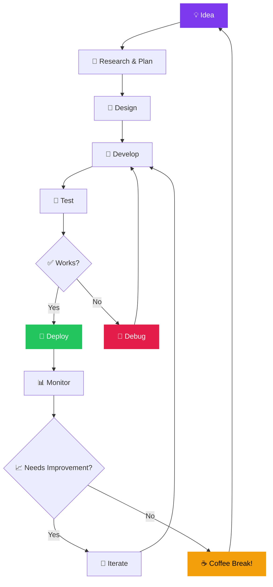

<!---

╔══════════════════════════════════════════════════════════════╗ 

║                                                              ║

║   ██████╗ ██╗   ██╗██████╗ ██████╗ ███████╗ █████╗ ██████╗   ║

║   ██╔══██╗██║   ██║██╔══██╗██╔══██╗██╔════╝██╔══██╗██╔══██╗  ║ 

║   ██████╔╝██║   ██║██████╔╝██████╔╝█████╗  ███████║██║  ██║  ║

║   ██╔══██╗██║   ██║██╔═══╝ ██╔═══╝ ██╔══╝  ██╔══██║██║  ██║  ║

║   ██████╔╝╚██████╔╝██║     ██║     ███████╗██║  ██║██████╔╝  ║

║   ╚═════╝  ╚═════╝ ╚═╝     ╚═╝     ╚══════╝╚═╝  ╚═╝╚═════╝   ║

║                                                              ║  

║               P R O F I L E   R E A D M E                    ║

║               ✦ Ultra Premium Edition ✦                     ║

║          @brutal-45 | [creatorsports81@gmail.com](mailto:creatorsports81@gmail.com)              ║

║                                                              ║

╚══════════════════════════════════════════════════════════════╝

-->

<!-- ==================== HERO BANNER ==================== -->

<br/>

<div align="center">


</div>

<!-- ==================== STATUS BADGES ==================== --> 

<div align="center"> 

[](mailto:creatorsports81@gmail.com)

[](https://github.com/brutal-45?tab=followers)

[](https://github.com/brutal-45)

[](https://github.com/brutal-45)

</div>

<br/>

<!-- ==================== TYPING ANIMATION ==================== -->

<div align="center">

<a href="https://git.io/typing-svg">

  

</a>

</div>

---

<!-- ==================== ABOUT ME ==================== -->

##   About Me

<div align="center">


</div>

```terminal

brutal-45@github:~$ whoami

╭─────────────────────────────────────────────────────────────────╮
│                                                                 |
│   🧑‍💻  USER       :  brutal-45                                   |
│   🎭  ROLE       :  Full-Stack Developer & Creator              |
│   📍  LOCATION   :  🌍 Earth                                   |
│   📧  EMAIL      :  creatorsports81@gmail.com                   |
│   💼  STATUS     :  🟢 Open to Collaboration                   |
│   🎓  LEARNING   :  Always                                      |  
│   ☕  FUEL       :  Coffee & Curiosity                          |   
│   🎯  GOAL       :  Make a dent in the universe                 |    
│                                                                  |      
│   💬  MOTTO      :  "Code hard, stay humble, ship fast."        |  
│                                                                 |    
╰─────────────────────────────────────────────────────────────────╯


```

<table>

<tr>

<td width="50%">

### 🌱 What I'm Up To

- 🔭 Currently **building exciting projects**

- 🌱 Always **learning new technologies**

- 🤝 Open to **open source collaboration**

- 🎯 Aiming for **2,500+ contributions**

- ✍️ Sharing **knowledge & code**

- 🏗️ Dreaming in **code & design**

</td>

<td width="50%">

### ⚡ Developer Facts

- 🐛 I squash bugs before breakfast

- 🔄 Refactor at 3 AM, deploy at dawn

- ☕ My blood type is `TypeScript`

- 🎮 Debug mode: `console.log` veteran

- 🧠 Always running in `learning mode`

- 🐧 Linux is my daily driver

- ⌨️ Mechanical keyboard enthusiast

- 🌙 Dark mode is the only mode

</td>

</tr>

</table>

---

<!-- ==================== TECH STACK ==================== -->

##   Tech Arsenal

<!-- Languages -->

### 

<div align="center">


</div>

<!-- Frameworks -->

### 

<div align="center">


</div>

<!-- Databases -->

### 

<div align="center">


</div>

<!-- Cloud & DevOps -->

### 

<div align="center">


</div>

<!-- Tools -->

### 

<div align="center">


</div>

---

<!-- ==================== SKILL PROFICIENCY ==================== -->

##   Skill Proficiency

<div align="center">

| Category | Skills |

|:--------:|:------:|

| [Frontend]([https://img.shields.io/badge/Frontend-90%25-7c3aed?style=flat-square](https://img.shields.io/badge/Frontend-90%25-7c3aed?style=flat-square)) | `████████████████████░░` React, Next.js, Vue, Tailwind |

| [Backend]([https://img.shields.io/badge/Backend-85%25-0ea5e9?style=flat-square](https://img.shields.io/badge/Backend-85%25-0ea5e9?style=flat-square)) | `█████████████████████░░` Node.js, Python, FastAPI |

| [Database]([https://img.shields.io/badge/Database-80%25-22c55e?style=flat-square](https://img.shields.io/badge/Database-80%25-22c55e?style=flat-square)) | `████████████████████░░░░` MongoDB, PostgreSQL, Redis |

| [DevOps]([https://img.shields.io/badge/DevOps-70%25-e11d48?style=flat-square](https://img.shields.io/badge/DevOps-70%25-e11d48?style=flat-square)) | `██████████████████░░░░░░` Docker, AWS, CI/CD |

| [Mobile]([https://img.shields.io/badge/Mobile-65%25-f59e0b?style=flat-square](https://img.shields.io/badge/Mobile-65%25-f59e0b?style=flat-square)) | `████████████████░░░░░░░░` React Native |

</div>

---

<!-- ==================== GITHUB STATS ==================== -->

##   GitHub Analytics

<div align="center">


</div>

<div align="center">


</div>

<!-- Summary Cards -->

<div align="center">


</div>

---

<!-- ==================== TROPHIES ==================== -->

##   Trophies & Achievements

<div align="center">


</div>


---

<!-- ==================== FEATURED PROJECTS ==================== -->

##   Featured Projects

<div align="center">

[](https://github.com/brutal-45/Nexus-LLM)

[](https://github.com/brutal-45/brutal-image)

[](https://github.com/brutal-45/Brutal-mod)

</div>

---

<!-- ==================== WORKFLOW ==================== -->

## 🔄 My Development Lifecycle

<div align="center">



</div>

---

<!-- ==================== PHILOSOPHY ==================== -->

## 🧠 Coding Philosophy

<div align="center">

<table>

<tr>

<td width="25%" align="center" bgcolor="0d1117">

### 🎯 Clean Code

> *"Any fool can write code that a computer can understand. Good programmers write code that* *humans** can understand."*

> — Martin Fowler

</td>

<td width="25%" align="center" bgcolor="0d1117">

### 🔄 Keep Learning

> *"The only way to learn a new programming language is by* *writing programs** in it."*

> — Dennis Ritchie

</td>

<td width="25%" align="center" bgcolor="0d1117">

### 🤝 Open Source

> *"Open source is not just about code — it's about* *community** and **collaboration**."*

> — Linus Torvalds

</td>

<td width="25%" align="center" bgcolor="0d1117">

### 🚀 Ship Fast

> *"Move fast and break things. Unless you are breaking stuff,* *you are not moving fast enough**."*

> — Mark Zuckerberg

</td>

</tr>

</table>

</div>

---

<!-- ==================== FUN ZONE ==================== -->

## 🎮 Dev Fun Zone

<div align="center">

```

 ╔═══════════════════════════════════════════════════════════════╗

 ║                                                               ║

 ║   $ git push --force                                          ║

 ║   > 😱 Wait... did I just...?                                 ║

 ║   > 💀 RIP production server                                  ║

 ║   > 🏃‍♂️ *deletes LinkedIn* *updates resume*                    ║

 ║                                                               ║

 ║   $ git log --oneline                                         ║

 ║   > fix bug                                                   ║

 ║   > fix bug again                                             ║

 ║   > fix bug for real this time                                ║

 ║   > FINAL bug fix                                             ║

 ║   > please just work                                          ║

 ║   > I give up                                                 ║

 ║   > actually fixed it (maybe)                                 ║

 ║                                                               ║

 ╚═══════════════════════════════════════════════════════════════╝

```


<br/>


</div>

---

<!-- ==================== CONTRIBUTING ==================== -->

## 🤝 How to Support Me

<div align="center">

[](https://github.com/brutal-45?tab=repositories)

[](https://github.com/brutal-45)

[](https://github.com/brutal-45?tab=repositories)

[](https://github.com/brutal-45)

</div>

---

<!-- ==================== CONNECT ==================== -->

## 🌐 Let's Connect

<div align="center">

[](mailto:creatorsports81@gmail.com)

[](https://github.com/brutal-45)

[](https://linkedin.com/in/)

[](https://x.com/)

[](https://dev.to/)

[](https://hashnode.com/)

</div>

---

<!-- ==================== VISITOR MAP ==================== -->

<div align="center">


</div>

---

<!-- ==================== FOOTER ==================== -->

<div align="center">


<p>

  

  

  

</p>

</div> 

