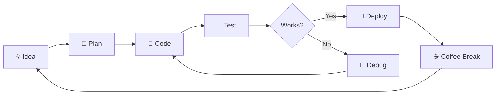

<!-- ============================================
     🌟 GITHUB PROFILE README — brutal-45 🌟
     Premium Edition | Dark Aesthetic
     ============================================ -->

<br/>
<div align="center">


<a href="mailto:creatorsports81@gmail.com">
  
</a>
<a href="https://github.com/brutal-45?tab=followers">
  
</a>


</div>

---

<!-- TYPING ANIMATION -->
<div align="center">


</div>

---

<!-- ABOUT ME — TERMINAL STYLE -->
## 🧑‍💻 `$ whoami`

```
> scanning user profile... ✓

 ┌─────────────────────────────────────────────────┐
 │  USER      :  brutal-45                         │
 │  ROLE      :  Full-Stack Developer              │
 │  STATUS    :  🟢 Available for collaboration   |
 │  LOCATION  :  🌍 Planet Earth                  │
 │  EMAIL     :  creatorsports81@gmail.com         │
 │  MOTTO     :  "Code hard, stay humble."         │
 └─────────────────────────────────────────────────┘
```

<table>
<tr>
<td>

### 🌱 Currently
- 🔭 Working on **exciting projects**
- 🌱 Learning **new frameworks & tools**
- 🤝 Open to **collaboration**
- 🎯 Goal: **1,000+ contributions**

</td>
<td>

### ⚡ Quick Facts
- 🐛 I squash bugs for breakfast
- ☕ Fuel: Coffee & Curiosity
- 🎮 Debug mode: `console.log` gang
- 🧠 Always in `learning mode`
- 🏗️ I refactor at 3 AM

</td>
</tr>
</table>

---

<!-- TECH STACK -->
## ⚙️ Tech Arsenal

### 🖥️ Languages
<p>
  
  
  
  
  
  
  
  
  
  
</p>

### 🧩 Frameworks & Libraries
<p>
  
  
  
  
  
  
  
  
  
  
</p>

### 🛠️ Tools & Platforms
<p>
  
  
  
  
  
  
  
  
  
  
  
  
</p>

---

<!-- SKILL BARS -->
## 📈 Skill Proficiency

<div align="left">


</div>

---

<!-- GITHUB STATS -->
## 📊 GitHub Analytics

<div align="center">


</div>

<div align="center">


</div>

---

<!-- TROPHIES -->
## 🏆 Achievements & Trophies

<div align="center">


</div>

---

<!-- CONTRIBUTION SNAKE -->
## 🐍 Contribution Snake

<div align="center">

<picture>
  <source media="(prefers-color-scheme: dark)" srcset="https://raw.githubusercontent.com/brutal-45/brutal-45/output/github-snake-dark.svg" />
  <source media="(prefers-color-scheme: light)" srcset="https://raw.githubusercontent.com/brutal-45/brutal-45/output/github-snake.svg" />
  
</picture>

</div>

> 💡 *Enable the snake animation by setting up [this GitHub Action](https://github.com/Platane/snk) workflow in your profile repo.*

---

<!-- CODING PHILOSOPHY -->
## 🧠 Coding Philosophy

<div align="center">

<table>
<tr>
<td width="33%" align="center">

### 🎯 Clean Code
> "Any fool can write code that a computer can understand. Good programmers write code that humans can understand."

</td>
<td width="33%" align="center">

### 🔄 Keep Learning
> "The only way to learn a new programming language is by writing programs in it."

</td>
<td width="33%" align="center">

### 🤝 Open Source
> "Open source is not just about code, it's about community and collaboration."

</td>
</tr>
</table>

</div>

---

<!-- FUN SECTION -->
## 🎮 Dev Fun

<div align="center">

```
    ┌──────────────────────────────────────────┐
    │                                          │
    │   $ git push --force                     │
    │   > 😱 Wait... did I just...?           │
    │   > 💀 RIP production server            │
    │   > 🏃‍♂️ *runs away*                      │
    │                                          │
    │   $ git log --oneline                    │
    │   > fix bug                              │
    │   > fix bug again                        │
    │   > fix bug for real this time           │
    │   > FINAL bug fix                        │
    │   > please just work                     │
    │                                          │
    └──────────────────────────────────────────┘
```


</div>

---

<!-- WORKFLOW VISUALIZATION -->
## 🔄 My Dev Workflow

<div align="center">



</div>

---

<!-- Pinned Repos Placeholder -->
## 📌 Featured Projects

> 🔥 *Star ⭐ my repos if you find them useful! Check out my pinned repositories below.*

<div align="center">

[](https://github.com/brutal-45)
[](https://github.com/brutal-45)

</div>

> 

---

<!-- CONNECT -->
## 🤝 Let's Connect & Collaborate

<div align="center">

[](mailto:creatorsports81@gmail.com)
[](https://github.com/brutal-45)
[](https://linkedin.com/in/)
[](https://twitter.com/)

</div>

---

<!-- VISITOR BADGE -->
<div align="center">


</div>

---

<!-- FOOTER -->
<div align="center">


**Made with ❤️ & ☕ by brutal-45**

</div>
